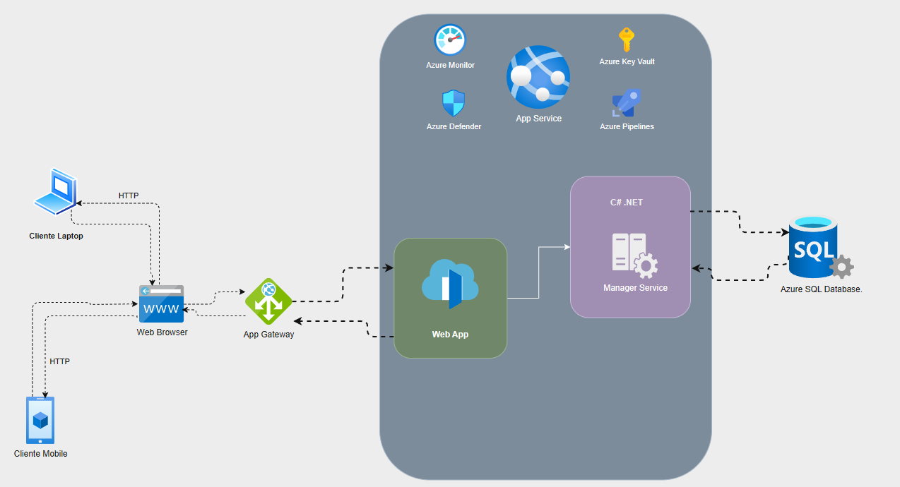

# ELearning Platform for ANP

This project is a comprehensive **eLearning system** designed for [Academia Nacional de Parrilleros]. The system aims to provide an intuitive platform for both instructors and learners, allowing the creation, management, and delivery of online courses. It offers a range of features tailored to the needs of modern education, including course creation, assessments, user management, and progress tracking.

**Note**: This is project for a friend’s business. For more information about the client’s official platform, please visit the [official landing page](https://anprm.com/).

## Features

- **Course Management**: Instructors can create and manage courses, including adding lessons, quizzes, assignments, and media content.
- **User Roles**: The system supports multiple user roles (e.g., Admin, Instructor, Learner) with specific permissions for each role.
- **Assessment & Quizzes**: Instructors can create quizzes and assignments for learners, with automatic grading and feedback.
- **Progress Tracking**: Learners can track their progress through courses, with completion certificates available upon finishing a course.
- **Interactive Content**: The platform supports various content formats, such as text, images, videos, and interactive assessments.
- **Discussion Forums**: Learners can interact with instructors and other learners via discussion forums.
- **Notifications**: Automated notifications are sent to users for important updates, assignments, and course milestones.
- **User Authentication**: Secure login with user authentication (via email and password, or social logins if necessary).

---

## Technologies Used

- **Frontend**: 
  - **HTML/CSS/JavaScript**: For structuring and styling the frontend.
  
- **Backend**: 
  - **C#**: The backend is developed using C# as the programming language.
  - **.NET**: The backend framework is built using .NET, enabling robust server-side functionality and RESTful API development.

- **Database**: 
  - **SQL Server**: Used for storing user data, course content, quiz results, etc.
  - **Entity Framework**: An ORM for interacting with the SQL Server database.

- **Deployment**:
  - **Azure**: The platform is deployed and hosted in the Azure cloud environment for scalability and performance.

- **Other Tools**:
  - **Git**: For version control and collaboration.
  - **Postman**: For API testing during development.

---
## This is a demonstration of the Architecture that was used in this development
  
